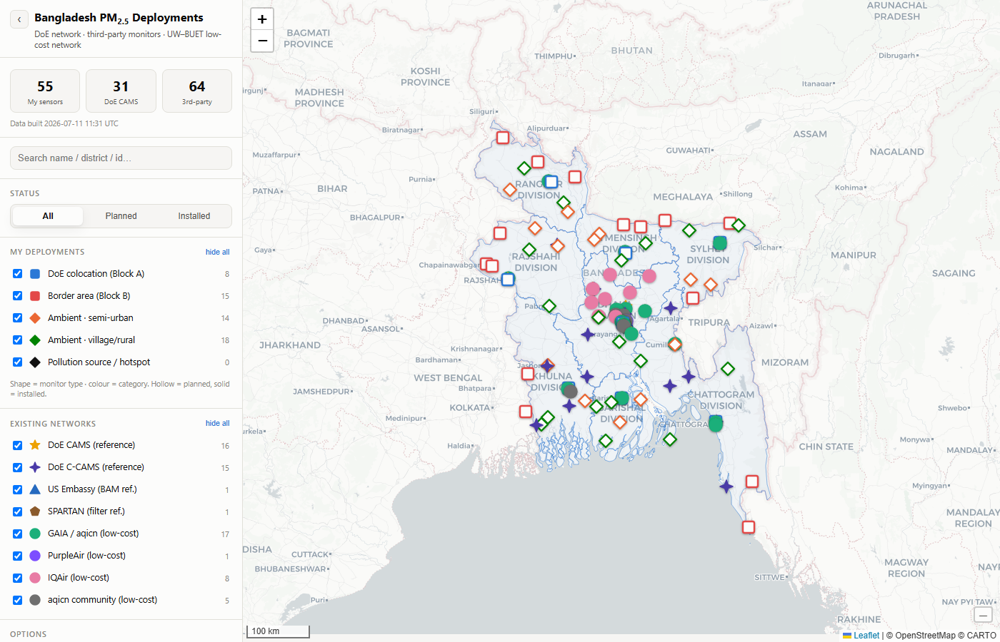

# Bangladesh PM2.5 Sensor Deployment Map

An interactive map of **every PM2.5 air-quality deployment in Bangladesh** — the DoE regulatory
network (CAMS + C-CAMS), the 10 **Source Apportionment Study (SAS)** areas, the **DoE proposed
55-unit PurpleAir plan**, all third-party/low-cost networks, and the **UW–BUET low-cost network**
being planned by Bishwadip Maitra. The map rebuilds from plain CSV files and redeploys to GitHub
Pages automatically on every push.

**Live map:** https://maitrabishwadip.github.io/UW-BUET-PM2.5-Sensor-Deployment-Map/
*(available once GitHub Pages is enabled — see [First-time setup](#first-time-setup))*



---

## What's on the map

Every deployment is drawn as a **map pin**. **Colour** identifies the layer; the **glyph in the pin
head** identifies the family, so four networks stacked on one compound stay readable. Super SAS
sites break the pattern deliberately — they are **red stars ★**.

The sidebar groups them as **My deployments** (the DoE PurpleAir 55 + the UW–BUET network),
**Super SAS**, and **Existing networks**.

| Section | Layer | Marker | Source |
|---|---|---|---|
| **My · DoE PurpleAir (55)** | On a CAMS + SAS compound (7) | navy pin **+** | `Proposed_Monitoring_Locations_Sheet.xlsx` |
| | On a rural SAS area (3) | teal pin **+** | ” |
| | New rural site (23) | green pin **+** | ” |
| | New urban site (4 — all awaiting siting) | purple pin **+** | ” |
| | New district, no existing CAMS (18) | crimson pin **+** | ” |
| **Super SAS (DoE)** | Source Apportionment Study area | **red ★** | DoE SAS table (7 CAMS-co-located + 3 rural) |
| **My · UW–BUET** | DoE colocation (Block A) | blue pin **◆** | this project |
| | Border area (Block B) | vermilion pin **◆** | this project |
| | Ambient · semi-urban | sand pin **◆** | this project |
| | Ambient · village/rural | teal pin **◆** | this project |
| | Pollution source / hotspot | black pin **◆** | this project *(placeholder — no sites yet)* |
| **Existing** | DoE CAMS / C-CAMS | amber / bronze pin **◎** | DoE Dec-2025 report |
| | US Embassy (BAM), SPARTAN | slate / brown pin **◎** | AirNow, SPARTAN |
| | PurpleAir, GAIA, IQAir, community | violet / mauve / pink / grey pin **●** | respective networks |

Glyphs: **◎** reference grade · **+** DoE proposed · **◆** UW–BUET · **●** low-cost.
A **solid gradient** pin is installed; a **pale** pin is proposed or planned.

### Co-located sites, and the 7 calibration compounds

19 sites host more than one station. The build clusters stations within **250 m** into one site, and
the map **fans them out on a small ring** with leader lines back to the true point, so nothing is
hidden. Each popup lists the other stations sharing that site. Toggle it with *Fan out co-located
sites*.

Seven of those are the plan's calibration compounds — **DoE CAMS + SAS area + a proposed PurpleAir
unit on one site** (Farmgate, TV Centre Chattogram, Sapura Rajshahi, Boyra Khulna, Red Crescent
Sylhet, DoE HQ Mymensingh, BTV Rangpur; six also carry a GAIA unit). The build detects them
structurally — not from a list — and tags them `colo_kind = cams_sas_pa`; the map draws a **dashed
red ring** around each. These are the urban halves of pairs P1–P7.

### Awaiting siting

Rows named in the source documents but with no coordinates are **not silently dropped** — they are
reported by the build and listed in the sidebar's *Awaiting siting* panel with the reason.

Interactivity: per-layer toggles with live counts, search over name/district/id/school/pair,
status filter, division shading with per-division totals on hover, marker clustering, basemap
switcher, dark mode, and shareable URL view state. See the survey of existing networks in
[`reports/third_party_deployments.md`](reports/third_party_deployments.md).

---

## The only files you edit: the CSVs

All sensor locations live in [`data/`](data/) as CSVs. **Nothing is hardcoded to "55"** — counts,
legend badges, and summaries are all derived from the rows at build time, so the network can grow.

```
data/my_deployments/
  doe_colocation.csv           Block A — 8 divisional DoE colocation sensors
  border.csv                   Block B — 15 border-area sensors
  ambient.csv                  Block C — 32 ambient sensors (tier = semi-urban | village)
  pollution_hotspot.csv        Block D — PLACEHOLDER, add rows when kiln/industry sites are confirmed
data/doe_proposed/             the DoE 55-unit PurpleAir proposal
  group_a_cams_paired.csv      31 units paired with existing CAMS / C-CAMS
  group_b_sas_paired.csv        6 units — rural SAS area + new urban counterpart (3 pairs)
  group_c_new_districts.csv    18 units in districts with no existing station
  pending_unspecified.csv       Patuakhali, Sunamganj — type/qty blank in the DoE table
data/existing/
  doe_cams.csv                 16 DoE CAMS   (reference)
  doe_ccams.csv                15 DoE C-CAMS (reference)
  doe_sas.csv                  10 Source Apportionment Study (SAS) areas
  third_party.csv              US Embassy, GAIA, PurpleAir, IQAir, community, SPARTAN
```

### The DoE proposed 55 (PurpleAir)

These 55 rows **are** the DoE-selected PurpleAir deployment. The authority for every row and
coordinate is the spreadsheet
[`source_docs/Proposed_Monitoring_Locations_Sheet.xlsx`](source_docs/Proposed_Monitoring_Locations_Sheet.xlsx)
(sheet *Proposed Sensor Locations*); `PM25_Sensor_Deployment_Plan.md` is a narrative restatement of
the same plan and is kept for context only. The popup's *Google Maps ↗* link is built from the same
lat/lon, so it resolves to the same point as the link in the sheet. (The `PA-01` row in
`third_party.csv` is a different thing: the ~17 PurpleAir units **already operating**, not part of
the 55.)

The sheet's own grouping is preserved end to end and is a filter on the map — **A · 31** paired with
an existing DoE CAMS, **B · 6** paired with a rural SAS area, **C · 18** in districts with no CAMS:

| Group | Units | Structure |
|---|---|---|
| **A** | 31 | 7 urban CAMS+SAS calibration compounds + their 7 rural counterparts (pairs P1–P7), then 16 single rural sites + Satkhira (urban) |
| **B** | 6 | 3 rural SAS areas + 3 new urban counterparts (pairs P8–P10) |
| **C** | 18 | one per district with no existing station, sited at a government school |

Patuakhali and Sunamganj are named in the sheet with no type or quantity — carried as
`status = pending` and **excluded** from the 55.

`data/doe_proposed/*.csv` rows are:

```
id, doe_group, pair_id, role, name, area_type, division, district,
lat, lon, associated_station, school, status, coord_precision, notes
```

- **`role`** drives the colour: `cams_colocated` | `sas_colocated` | `new_rural` | `new_urban` |
  `new_district` | `unspecified`.
- **`pair_id`** (P1…P10) ties the two halves of a "1+1 (w/ SAS)" entry together — each such entry is
  **two physical units**, one at the urban CAMS/SAS reference and one at a distinct rural site.
- **`status = pending`** marks a district the DoE table names without a type or quantity; those rows
  are excluded from the 55-unit total.
- The seven urban CAMS+SAS rows carry `coord_precision = derived` — the source table gives no
  coordinates, so lat/lon come from the co-located CAMS station in `doe_cams.csv`.

The build prints the derived unit total (`DoE proposed units: 55`) — the number is never hardcoded.

### Adding / updating your sensors

Each `data/my_deployments/*.csv` row is:

```
id, category, tier, name, division, district, lat, lon, status, coord_precision, notes
```

- **`lat` / `lon`** — decimal degrees. **Leave both empty** and the row is skipped with a warning
  (this is the placeholder mechanism). Fill them in later and the marker appears on the next build.
- **`status`** — `proposed` | `planned` | `installed`. `installed` renders a **solid** marker; the
  others render **hollow**.
- **`coord_precision`** — `approx` (planning-stage) or `exact` (confirmed after recon).
- **`category`** — `doe_colocation` | `border` | `ambient` | `pollution_hotspot` (fixed set).
- **`tier`** — for `ambient`: `semi-urban` or `village` (drives orange vs green). Free text otherwise.

**To add pollution-source sensors** (not yet sited): open
[`data/my_deployments/pollution_hotspot.csv`](data/my_deployments/pollution_hotspot.csv), copy an
example row, uncomment it, fill in name/division/district (and lat/lon when known), then rebuild.

---

## Rebuild & preview locally

```bash
python scripts/build_map.py            # validates CSVs -> docs/data/*.json  (fails loudly on bad rows)
python -m http.server -d docs 8000     # then open http://localhost:8000
```

The build **fails with a clear message** (and non-zero exit, which also fails CI) on: out-of-bounds
coordinates, unknown `status`/`category`/`role`/`division`, duplicate ids, or missing columns.
Empty-coordinate rows are reported as `PENDING` and surface in the map's *Awaiting siting* panel.

---

## Publish (edit → push → live)

```bash
git add -A
git commit -m "Update sensor coordinates"
git push
```

The [GitHub Actions workflow](.github/workflows/deploy.yml) reruns `build_map.py` and redeploys the
`docs/` site to GitHub Pages. No build step runs in the browser — the committed `docs/data/*.json`
is what ships, so a push is all you need.

### First-time setup

Pages must be enabled once:

1. Repo → **Settings → Pages**
2. **Source: GitHub Actions**
3. Push to `main` (or re-run the workflow). The live URL appears in the Action's *deploy* step and at
   the top of this README.

---

## Regenerating the boundary file (rarely needed)

`data/boundaries/bd_divisions_simplified.json` (91 KB) is a one-time simplification of the 32 MB
`bd.json`. Only regenerate if the source boundary changes:

```bash
npx mapshaper data/boundaries/bd.json -simplify keep-shapes 2% -clean \
  -o precision=0.0001 format=geojson data/boundaries/bd_divisions_simplified.json
```

---

## Repo layout

```
data/            editable CSVs (sources of truth) + boundaries
scripts/         build_map.py  (stdlib only, no dependencies)
docs/            the published site (index.html + assets + generated data/)
reports/         third_party_deployments.md — survey of existing networks
source_docs/     Proposed_Monitoring_Locations_Sheet.xlsx (authority for the 55) + DoE PDF/DOCX
.github/         Pages CI/CD workflow
```

Coordinates for every planned sensor are planning-stage approximations; confirm exact sites by
reconnaissance before installation. Where the DoE table named only a district, the nearest
identifiable government primary school is used as a **siting anchor**, not a confirmed GPS point —
`coord_precision` records which is which, and the per-site `notes` flag the weak ones
(Brahmanbaria, Kushtia, Kurigram, Sylhet, Chattogram, Pirojpur).
